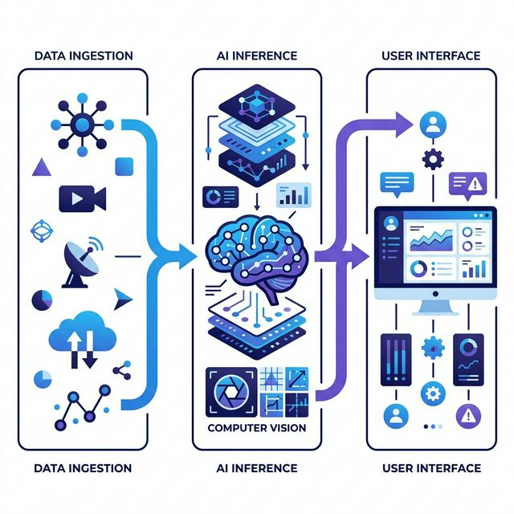
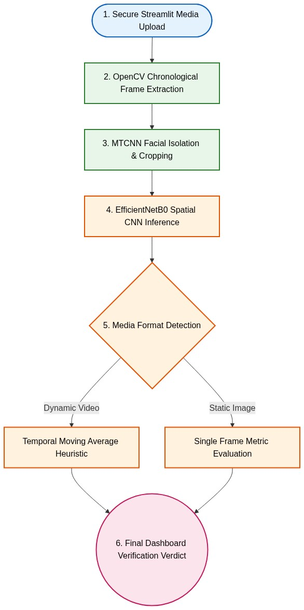
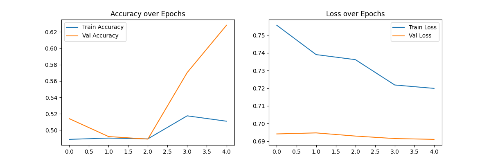
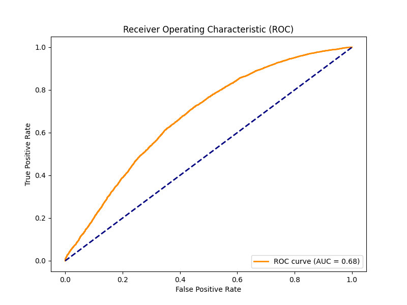
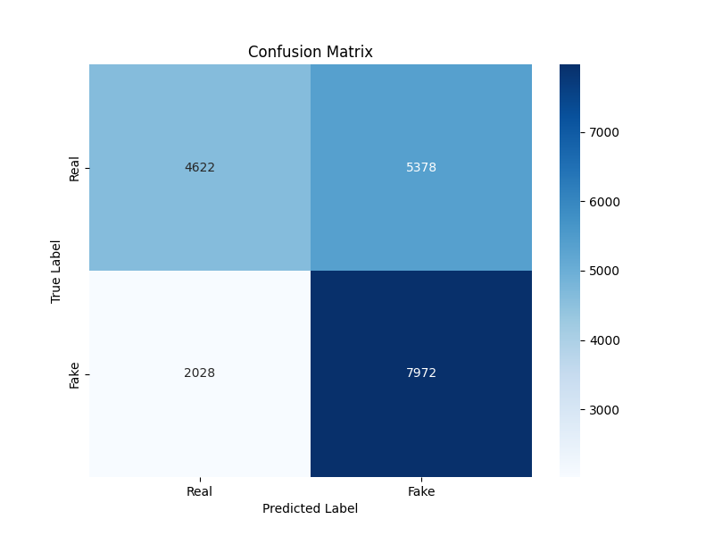

# DeepGuard: AI Media Authenticity Scanner

DeepGuard is an applied AI project that screens images and short videos for
possible AI generation or manipulation. It combines a Streamlit interface,
Hugging Face image-classification inference, OpenCV video frame sampling, and
clear confidence visualizations so users can inspect media in a simple browser
workflow.

The project is intentionally framed as a research and education tool. Its output
is a model probability, not forensic proof. The goal is to demonstrate practical
AI product engineering around media authenticity: input handling, inference,
video sampling, confidence reporting, deployment readiness, testing, and
responsible limitation messaging.

<br>The Experimental version is live now.[Click here.](https://deepgaurd-deepfakedetection.streamlit.app/)<br>

## Screenshots And Visuals

### System Architecture



The application is organized around three layers:

- **Data ingestion:** image upload, direct image URL ingestion, and short-video
  upload.
- **AI inference:** model-backed real/fake probability scoring for still images
  and sampled video frames.
- **User interface:** Streamlit dashboard with verdict cards, progress feedback,
  per-frame charts, and sampled-frame previews.

### Legacy Research Workflow



This diagram documents the earlier experimental direction of the project, which
explored a local computer-vision pipeline with frame extraction, face-oriented
processing, and CNN inference. The current deployable app uses a leaner Hugging
Face inference path, while the legacy experiments are preserved in
`experiments/` for transparency.

### Evaluation Artifacts From Earlier Experiments







These reports are included to show the evaluation process and to document why
the project is presented as a demo rather than a production forensic detector.
The archived local model reached an ROC AUC of about 0.68, which is useful for
learning and analysis but not strong enough for high-stakes verification.

## What The App Does

DeepGuard supports two user workflows.

**Image analysis:** A user uploads an image or pastes a direct image URL. The app
loads the image, normalizes it to RGB, sends it through the configured Hugging
Face image-classification model, maps the returned labels to a fake-probability
score, and displays a verdict with model confidence.

**Video analysis:** A user uploads a short video. The app checks the duration,
samples evenly spaced frames with OpenCV, runs each frame through the same image
classifier, averages the frame-level scores, and shows both an overall verdict
and a per-frame probability chart.

## Key Features

- Image input through file upload or direct URL.
- Short-video support through frame sampling.
- Per-frame fake-probability chart for videos.
- Sampled-frame preview grid with frame-level labels.
- Configurable model through the `MODEL_ID` environment variable.
- Safe model-load failure handling with readable error output.
- Basic URL validation and image-size checks.
- Clear responsible-use disclaimer inside the interface.
- Smoke tests for scoring logic and model failure behavior.
- Deployment-oriented project structure with pinned dependencies.

## Technical Stack

| Area | Tools |
| --- | --- |
| App framework | Streamlit |
| AI inference | Hugging Face Transformers |
| Model runtime | PyTorch |
| Video processing | OpenCV |
| Image handling | Pillow |
| Data display | Pandas, Streamlit charts |
| Testing | Python unittest / pytest-compatible smoke tests |

## Current Model Approach

The app uses the Hugging Face model specified by `MODEL_ID`. By default:

```text
umm-maybe/AI-image-detector
```

The model returns image-classification labels and scores. DeepGuard maps labels
containing terms such as `fake`, `synthetic`, `generated`, `ai`, or `artificial`
to a fake probability. Labels such as `real`, `human`, `natural`, `authentic`,
or `photograph` are mapped to the inverse probability.

This abstraction keeps the app flexible: the deployed classifier can be swapped
without rewriting the Streamlit workflow, as long as the replacement model
returns recognizable real/fake-style labels.

## Processing Pipeline

```text
User media
  |
  |-- Image upload / direct URL
  |       |
  |       `-- RGB conversion -> model inference -> confidence verdict
  |
  `-- Video upload
          |
          `-- duration check -> frame sampling -> per-frame inference
              -> average score -> chart + verdict
```

For video, the app samples a configurable number of evenly spaced frames instead
of trying to process every frame. This keeps the interaction responsive while
still giving a useful overview of how suspicious content may vary through the
clip.

## Repository Structure

```text
.
|-- .streamlit/
|   `-- config.toml
|-- figures/
|   |-- architecture.png
|   `-- workflow.png
|-- reports/
|   |-- confusion_matrix.png
|   |-- roc_curve.png
|   `-- training_history.png
|-- src/
|   `-- app/
|       `-- app.py
|-- tests/
|   `-- test_app_smoke.py
|-- experiments/
|   |-- legacy/
|   `-- local-model-artifacts/
|-- LICENSE
|-- Procfile
|-- packages.txt
|-- requirements.txt
`-- runtime.txt
```

## Important Files

- `src/app/app.py`: Streamlit application, input handling, model loading,
  prediction mapping, video frame extraction, and UI rendering.
- `tests/test_app_smoke.py`: lightweight tests that mock Streamlit and model
  dependencies to validate scoring behavior without downloading a model.
- `figures/`: visual project diagrams for GitHub/readme presentation.
- `reports/`: evaluation plots from earlier local-model experiments.
- `experiments/`: archived exploratory scripts and local model artifacts kept
  outside the deployable app path.

## Engineering Decisions

**Hugging Face inference instead of local TensorFlow loading:** The archived
local Keras model had limited measured performance, so the deployable app uses a
configurable Hugging Face classifier and documents the legacy model honestly.

**Frame sampling for videos:** Full video analysis is expensive for a small
interactive app. Sampling evenly spaced frames gives a practical balance between
speed and signal.

**Explicit uncertainty messaging:** The UI avoids presenting results as truth.
Low-confidence predictions are shown as uncertain, and the README explains that
probabilities are not forensic conclusions.

**Small smoke-test surface:** The tests focus on the most important logic:
mapping model labels into fake probabilities and failing clearly when the model
is unavailable.

## Local Usage

Use Python 3.11.

```bash
python -m venv .venv
.venv\Scripts\activate
pip install -r requirements.txt
streamlit run src/app/app.py
```

On macOS/Linux:

```bash
python3 -m venv .venv
source .venv/bin/activate
pip install -r requirements.txt
streamlit run src/app/app.py
```

Run the smoke tests:

```bash
python -m pytest
```

## Limitations

- DeepGuard is not forensic proof.
- Model confidence is not the same thing as truth.
- Results can be wrong for compressed images, screenshots, cartoons, edited
  real images, synthetic images outside the model distribution, or adversarial
  examples.
- Video analysis samples frames only; it does not inspect audio, face landmarks,
  temporal consistency, metadata, lighting physics, or compression traces.
- The default model can be replaced, but any replacement should be evaluated
  before serious use.

## What This Project Demonstrates

- Building an end-to-end AI demo around a real-world trust and safety problem.
- Designing a usable Streamlit interface for image and video workflows.
- Integrating Hugging Face inference into a lightweight web app.
- Using OpenCV for practical video frame sampling.
- Communicating AI uncertainty and limitations responsibly.
- Keeping experiments, reports, tests, and deployable app code separated.

## Resume Summary

Built DeepGuard, an AI media-authenticity scanner using Streamlit, Hugging Face
Transformers, PyTorch, OpenCV, and Pillow. The app supports image upload, direct
URL analysis, short-video frame sampling, confidence visualization, per-frame
charts, smoke-tested inference logic, and responsible AI limitation messaging.

## License

MIT License. See `LICENSE`.
